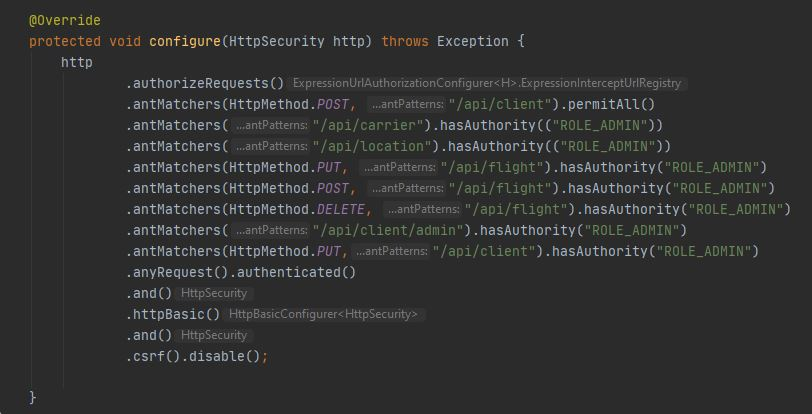
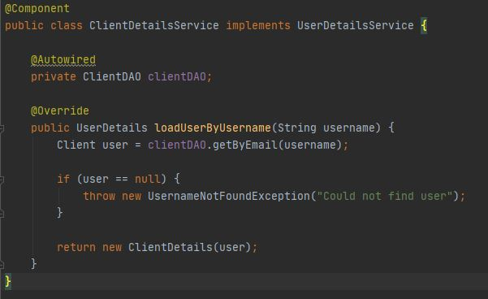
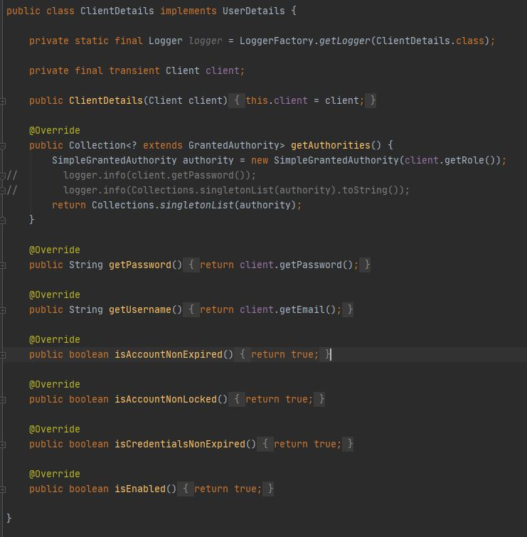
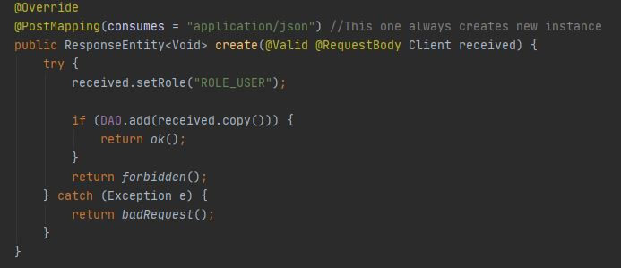
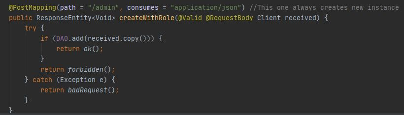
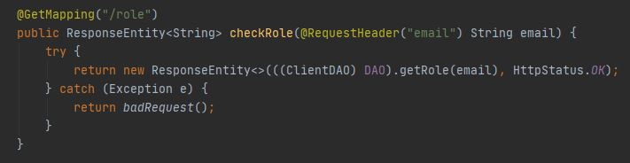

# Ticket system

## Contributors
- [Paweł Miziołek](https://github.com/pawel00100)

- [Wiktor Kamiński](https://github.com/WikKam)

- [Karol Koptyra](https://github.com/what-ewer)

- [Radosław Kopeć](https://github.com/radekkpc)

## Technologies

- Java 14
- Spring Boot
- Spring JPA
- JavaFX
- Spring Security

## Data model

 
 **Model includes classes:**
- Flight - *information about each individual flight - contains arrival and departure times, source and destination locations, flight carrier and base flight price*
- Client - *information about each individual client - their first and last name and email*
- Order - *information about order - to which client it belongs - it is also connected to tickets so that you can see which tickets belong to the order*
- Ticket - *information about the ticket - to which passenger it belongs, from which order as well as some basic information such as final (possibly discounted) cost and seat*
- Passenger - *information about passenger - their first and last name(as client can buy tickets for other family members)*
- Location - *information about location airport - city, country and airport id*
- Carrier - *information about carrier - carriers name*

## Architecture

Software is split into separate applications. Backend based on Spring that publishes REST endpoints, and frontend with UI that consumes API.

## Run
 - Open Command line in /backend and type gradle bootRun, then in /frontend type gradle run

## User Interface

User interface currently includes main page, add carrier page and add user page -> they are supposed to be for superuser(admin) only, but currently logging in is not implemented in m1

### Login page

Page so client can login/register to access app

### Main page

On the left side we can see logo and buttons to access multiple other panels. (some of the functionalities weren't implemented yet)

Clicking the button opens panel on the right side, left side stays intact.

### Add User

The add user panel allows admin to add users to database, before sending request to database it checks wheter first and last names are empty and checks regex for email.

We can see that the email input is wrong. If everything is okay the request to database is sent.

### Add Carrier
The add carrier panel allows us to add carriers to database.

As we can see above - the carrier was successfully added to database.

### Add location

Ability to add the location to database

### Flights Panel
The flights panel allows us to see all the flights and allows us to add flight to the database

As we can see we could add flight with the new Carrier we have added above

### Search flights panel

We can search flights based on departure and arrival location and time and also on price

After search we can see the changes

## Authentication and Authorization

We used Spring Security to implement  Authentication and Authorization. 
Each user has role in the system (USER or ADMIN). 
We used following piece of code in WebSecurityConfig class to check has user permission to send request at specific endpoint:

When the new request come, Spring Security check conditions. Here we can see endpoint like "/api/client/admin" or
"/api/flight", which need ADMIN ROLE to be obtained. ".anyRequest().authenticated()" part is used to authenticate
user. We can also specify endpoint which not need authorisation for example: "antMatchers(HttpMethod.POST, "/api/client").permitAll()"
allow each user to register.
To authorise user we use Basic Authorisation. We always send email and password in request header.
From definition Rest Api need to be stateless, cannot remember the session, it is why we decided to use
Base Auth to authorise and authenticate.
Very important class is ClientDetailsService which implements UserDetailsService interface. It is interface defined in 
the Spring Sercurity Library. Interface force to implement method to get user by his name (email in our case). Spring security use this class to
obtain user details object.

ClientDetails is class which implements UserDetails (also interaface from Spring Security). This class allow
Spring security to obtain authorisation roles as well as password, user name and another things needed for
authorise and authenticate User.

#### Registartion endpoint
Here we have a registration endpoint in the ClientController class. After registration at the application start page,
We set user role to ROLE_USER. To create admin we have to log in as admin and then create one. 

#### Endpoint used to create new admins
This endpoint allows admins to create new admins and users. Admin send Client in the request body and we
just add new one.

#### Role endpoint
This endpoint allow to check user role. It is used to split view for admin and user parts.

## Design patterns used
* **MVC** - it is not completed in m1 yet(we do not yet have property mapping and binding to data model), we want to
  seperate representation of information from the way it is presented and accepted from the user in view part(gui)
* **DAO** - uses Spring Repository class methods and transforms them into more practical methods used in endpoint code
* **IOC** - provided by Spring, used for most classes
* # TODO

## Task distribution
We distributed tasks among ourselves using JIRA so that we could keep track on our progress and try to distribute them more evenly 
### Frontend
* **start of frontend project** - Wiktor Kamiński
* **generified REST client** - Wiktor Kamiński
* **make GUI for main component** - Wiktor Kamiński
* **AddCarrier and AddUser GUIs** - Wiktor Kamiński
* **controller functionalities to change between scenes** - Karol Koptyra
* **HomeController** - Karol Koptyra
* **AddCarrierController** - Karol Koptyra
* **AddUserComponent** - Karol Koptyra
* **generified REST client** - Wiktor Kamiński
* **login/register page** - Karol Koptyra
* **listing all flights** - Karol Koptyra, Wiktor Kamiński
* **adding flights** - Wiktor Kamiński
* **REST controller has authentication** - Karol Koptyra, Wiktor Kamiński
* **new layout** - Wiktor Kamiński
* **search flights panel** - Karol Koptyra
* **search flights logic** - Karol Koptyra
* **add location controller** - Karol Koptyra
* **add roles field to create admins at admin view** - Radosław Kopeć
* **split views on admin and users parts** - Radosław Kopeć
* **add authorisation (obtaining user role)** - Radosław Kopeć
### Backend
* **start of backend project** - Paweł Miziołek
* **data model** - Paweł Miziołek
* **add Destination to data model** - Radosław Kopeć
* **obtain SQL database** - Radosław Kopeć
* **add Hibernate** - Radosław Kopeć
* **generating sample data** - Paweł Miziołek
* **create user endpoint** - Radosław Kopeć
* **create Spring repositories with JPA** - Radosław Kopeć
* **established data base connection** - Radosław Kopeć
* **adding services** - Paweł Miziołek
* **generify endpoint code** - Paweł Miziołek
* **implementation of SQLite** - Paweł Miziołek
* **user authentication simpleauth** - Paweł Miziołek
* **carrier endpoint** - Paweł Miziołek
* **generify REST + add remaining endpoints** - Paweł Miziołek
* **Add authorisation and roles** - Radosław Kopeć
* **Add endpoint to create admins** - Radosław Kopeć
* **Add permisions for the client ( on which endpoint can user send request)** - Radosław Kopeć
* **Repair bug with double encoding while register user** - Radosław Kopeć, Karol Koptyra
* **Add endpoint to create Order with Flight,Tickets,User and Passengers passed into json** - Radosław Kopeć
* **Adding count of allowed places to the flight when is taking from the REST API** - Radosław Kopeć

### Documentation

* **documentation in readme** - Karol Koptyra 
* **fixes in documentation** - everyone in team 
* **add authorisation,authentication and registration endpoints documentation** - Radosław Kopeć

